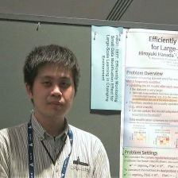

A researcher on information science.

-   [Publications (業績)](publications/)
-   [Research Funds (研究費)](funds/)
-   [Notes about research --  mainly mathematical topics (研究関連のメモ -- 主に数学)](memo/)

  
(At the poster session in AAAI2018 on 5th February 2018)

# Research (研究)

-   Interests
    -   Flexible information retrieval
    -   Data structure
    -   Optimization algorithms
-   Topics
    -   Since 2019:
        -   Machine learning for semi-structured data (sequences, graphs, etc.)
    -   Since 2015:
        -   Machine learning under privacy-sensitive situations (learning with limited data disclosure via encryption, etc.)
        -   Machine learning for changing data / data modifications
    -   Since 2014:
        -   Enumeration over graphs (path/trail enumeration, path/trail conversion over line graph, etc.)
    -   Since 2006:
        -   String similarity and its applications (Approximate string matching, Edit distance, q-gram distance, Edit distance approximation)

# Affiliation (所属)

See the [Research Funds](funds/) page for the projects which I received funds.

-   June 2019 - PRESENT
    -   Post-doctoral researcher
    -   RIKEN, [Center for Advanced Intelligence Project](https://aip.riken.jp/), Data-Driven Biomedical Science Team
-   April 2015 - May 2019
    -   Researcher (Project Assistant Professor)
    -   Nagoya Institute of Technology, [Department of Computer Science](http://www.cs.nitech.ac.jp/) (\*1), [Takeuchi&Karasuyama Laboratory](http://www-als.ics.nitech.ac.jp/)
-   May 2014 - March 2015
    -   Researcher (August 2014 - March 2015) / Research Assistant (May 2014 - July 2014 )
    -   Japan Science and Technology Agency (JST) (working at Hokkaido University), [ERATO Minato Discrete Structure Manipulation System Project](http://web.archive.org/web/20210617055940/http://www-erato.ist.hokudai.ac.jp/)
-   April 2007 - March 2014
    -   Master course (April 2007 - March 2009) / Doctoral course (April 2009 - March 2014) / Received PhD on 30th June 2014
    -   Hokkaido University, [Graduate School of Information Science and Technology](https://www.ist.hokudai.ac.jp/), Computer Science Division, [Laboratory for Pattern Recognition and Machine Learning](http://prml.main.ist.hokudai.ac.jp/)

(\*1) As Department of Scientific and Engineering Simulation until March 2015  

# Links (リンク)

-   ORCID: [https://orcid.org/0000-0002-2139-3857](https://orcid.org/0000-0002-2139-3857)
-   ResearchGate: [https://www.researchgate.net/profile/Hiroyuki_Hanada](https://www.researchgate.net/profile/Hiroyuki_Hanada)
-   ResearchMap: [https://researchmap.jp/hana-hiro](https://researchmap.jp/hana-hiro)
-   GitHub: [https://github.com/hana-hiro](https://github.com/hana-hiro)

# Contact (連絡先) 

-   Address for current position: hiroyuki0hanada@riken.jp (replace '0' with dot)
-   Personal address: hana1hiro@live.jp (replace '1' with hyphen)
