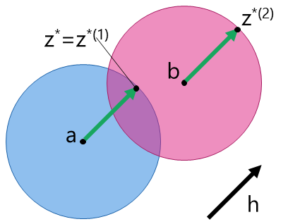
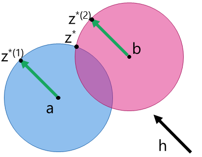
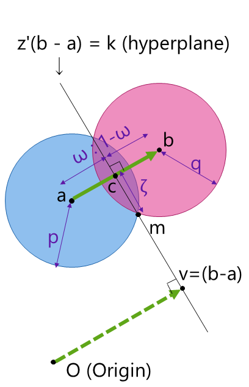

-   [Back to top page](../../)
-   [Back to other notes](../)

# Maximizing inner product in the intersection of two hyperspheres (2つの超球の共通部分内で内積を最大化する)

## Problem setup (問題設定)

Given vectors $$a, b, h\in \mathbb{R}^n$$ and positive numbers $$p, q > 0$$, we would like to maximize the inner product $$h^\top z$$ on condition that $$z$$ is in the intersection of two hyperspheres $$S_1  = \{ z \mid \|z - a\| \leq p \}$$ and $$S_2 = \{ z \mid \|z - b\| \leq q \}$$.

What we would like to compute are summarized as $$f$$ and $$z^*$$ below:

$$ f = \max_{ z\in S_1 \cap S_2 } h^\top z, $$  
$$ z^* = \mathrm{arg}\max_{z\in S_1 \cap S_2} h^\top z. $$

Note that $$h^\top z^* = f$$.

## Solution (答え)

### Step 1: Judge whether the optimum in question (optimum for two hyperspheres) is calculated as the optimum of either hypersphere (求めたいものは2つの超球についての最適値だが、それを1つの超球の最適値として得られるか判定する)

First we define the followings:

$$ f_1 = \max_{z\in S_1} h^\top z, $$  
$$ f_2 = \max_{z\in S_2} h^\top z, $$  
$$ z^*_1 = \mathrm{arg}\max_{z\in S_1} h^\top z, $$  
$$ z^*_2 = \mathrm{arg}\max_{z\in S_2} h^\top z. $$

Then 
$$z^*_1$$
and
$$z^*_2$$
are computed as:

$$z^*_1 = a + \frac{p}{\|h\|}h,$$  
$$z^*_2 = b + \frac{q}{\|h\|}h.$$

Therefore,

-   If $$z^*_1\in S_2$$, then $$z^* = z^*_1$$ and thus $$f = f_1 = h^\top z^*_1$$.
-   If $$z^*_2\in S_1$$, then $$z^* = z^*_2$$ and thus $$f = f_2 = h^\top z^*_2$$.
-   Otherwise, go to step 2.

### Step 2: Calculate the optimum specifically when the optimum is not obtained as the optimum of either hypersphere (最適値が1つの超球の最適値として得られない場合に、具体的に計算する)

In this case, $$z^*$$ is calculated as

$$z^* = c + \frac{\zeta}{\|\mu\|}\mu,$$

where

$$d = \|b - a\|,$$  
$$\omega = (1/2) - [q^2 - p^2] / [2 d^2],$$  
$$c = a + \omega(b - a),$$  
$$\zeta^2 = p^2 - \omega^2 d^2,$$  
$$L = h^\top(b - a) / d^2,$$  
$$\mu = h - L(b - a).$$

## Note for Step 1

The condition $$z^*_1\in S_2$$ (the similar for $$z^*_2\in S_1$$) clearly holds if $$S_1 \subseteq S_2$$.
However, even if $$S_1 \subseteq S_2$$ does not hold, $$z^*_1\in S_2$$ may hold.

We present the following figures again in order to explain these cases above.
Figure 1 is the case of $$z^*_1\in S_2$$ and therefore $$f = f_1$$ ($$z^* = z^*_1$$).
Figure 2 is the case of neither $$z^*_1\in S_2$$ nor $$z^*_2\in S_1$$.
As seen in the figure, in the second case the optimum $$z^*$$ is found on the intersection of two hyperspheres. This is proved in the next step.

  
Figure 1: An example of being $$z^*_1\in S_2$$ and therefore $$f = f_1$$ ($$z^* = z^*_1$$).

  
Figure 2: An example of being neither $$z^*_1\in S_2$$ nor $$z^*_2\in S_1$$.

## Proof of Step 2

If neither $$f = f_1$$ nor $$f = f_2$$ (i.e., $$z^*_1\in S_2$$ nor $$z^*_2\in S_1$$), how $$z^*$$ should be?

Since $$S_1 \cap S_2$$ is a closed finite convex set, $$z^*$$ must reside on the surface of $$S_1 \cap S_2$$.
Here, the surface of $$S_1 \cap S_2$$ can be divided into three components:

-   Component 1: surface of $$S_1$$ but not of $$S_2$$ (i.e., surface of $$S_1$$ and also interior of $$S_2$$),
-   Component 2: surface of $$S_2$$ but not of $$S_1$$ (i.e., surface of $$S_2$$ and also interior of $$S_1$$), or
-   Component 3: surface of both $$S_1$$ and $$S_2$$ (i.e., the intersection of surfaces of $$S_1$$ and $$S_2$$).

If $$z^*_1$$ resides on the component 1, then $$z^* = z^*_1$$ must hold since $$z^*_1\in S_2$$.
Similarly, if $$z^*_2$$ resides on the component 2, then $$z^* = z^*_2$$ must hold since $$z^*_2\in S_1$$.
So, what we should consider is the component 3: the intersection of surfaces of $$S_1$$ and $$S_2$$.

Let $$T$$ be the intersection of surfaces of $$S_1$$ and $$S_2$$, that is,

$$T = \{ z \mid \|z - a\| = p, \|z - b\| = q \}.$$

Then, let us calculate $$T$$ more specifically. By Lemmas 1 through 3, we can prove that it is equivalent to

$$T = \{ z | \|z - c\| = \zeta, z^\top(b - a) = k\},$$
where  
$$c = a + \omega(b - a),$$  
$$\omega = (1/2) - [q^2 - p^2] / [2 d^2],$$  
$$\zeta^2 = p^2 - \omega^2 d^2,$$  
$$k = [\|b\|^2 - \|a\|^2 - (q^2 - p^2)] / 2.$$

So, $$T$$ is a surface of a hypersphere on the (n-1)-dimensional subspace $$z^\top(b - a) = k$$.

  

To maximize $$h^\top z$$ on this $$T$$, we need to take $$z$$ for the same direction as $$h$$ as possible:
due to the constraint that $$z$$ must be on $$T$$, we may not take $$z = (\zeta/\|h\|)h$$.
To maximize this, we do the followings:

-   Let us decompose $$h$$ into the vector in the subspace (denoted by $$\mu\in \mathbb{R}^n$$) and perpendicular to the subspace (represented as $$L(b - a)$$, where $$L\in \mathbb{R}$$), that is, $$\mu = h - L(b - a)$$ subject to $$\mu^\top(b - a) = 0$$.
    -   This is solved as $$L = h^\top(b - a) / d^2$$.
-   Take $$z = c + (\zeta / \|\mu\|)\mu$$ to maximize $$h^\top z$$.

Therefore, $$z^* = c + (\zeta / \|\mu\|)\mu$$ if neither $$f = f_1$$ nor $$f = f_2$$.

## Lemmas

### Lemma 1

Let $$a$$, $$b$$ in $$\mathbb{R}^n$$, and
$$T = \{ z \in \mathbb{R}^n \mid \|z - a\| = p, \|z - b\| = q \}.$$  
Then, $$T$$ is in certain hyperplane, that is, there exists $$v\in \mathbb{R}^n$$ and $$k\in \mathbb{R}$$ such that $$\forall m \in  T \to m^\top  v = k$$.

Here, let $$H[T]$$ be the hyperplane defined above.

#### Proof

Because $$\|m - a\| = p$$ and $$\|m - b\| = q$$, we have  
$$\|m\|^2 - 2a^\top  m + \|a\|^2 = p^2,$$  
$$\|m\|^2 - 2b^\top  m + \|b\|^2 = q^2.$$

Taking the difference of them, we have  
$$2(a - b)^\top m + \|b\|^2 - \|a\|^2 = q^2 - p^2$$  
and therefore
$$v = b - a,$$  
$$k = \frac{\|b\|^2 - \|a\|^2 - (q^2 - p^2)}{2}.$$

### Lemma 2

Let $$a$$ and $$b$$ be points in Lemma 1.
Let $$c = a + \omega(b - a)$$ ($$0 \leq \omega \leq 1$$), that is, $$c$$ is a point on the line segment between $$a$$ and $$b$$.
Then, $$c$$ is on the hyperplane $$H[T]$$ if  
$$\omega = \frac{1}{2} - \frac{q^2 - p^2}{2 d^2}.$$

#### Proof

If $$c$$ is on the hyperplane $$H[T]$$, $$\omega$$ can be computed as  
$$[a + \omega(b - a)]^\top(b - a) = k.$$

As a result,
$$\omega d^2 = k - a^\top(b - a) = \frac{d^2 - (q^2 - p^2)}{2}.$$

### Lemma 3

There exists a positive real number $$\zeta > 0$$ such that

>   For any
>   $$m\in \mathbb{R}^n,$$
>   $$m\in T$$
>   in Lemma 1 holds if and only if $$m$$ is on the hyperplane $$H[T]$$ and also on the surface of the hypersphere $$\|m - c\| = \zeta$$.

#### Proof

By the Pythagorean theorem, we can calculate as $$\zeta^2 = p^2 - \omega^2 d^2$$. This $$\zeta$$ assures the sufficiency of the theorem.

Let us prove the necessity, that is, any m\in T is on both $$H[T]$$ and $$\|m - c\| = \zeta$$, where the former is already proved as Lemma 1.

Calculating $$\|m - c\|^2$$ we have

$$\|m - c\|^2 = \|c\|^2 - 2m^\top  c + \|m\|^2$$  
$$= \|c\|^2 - 2m^\top(a + \omega(b - a)) + \|m\|^2$$  
$$= \|c\|^2 - 2m^\top  a + \|m\|^2 - 2\omega m^\top(b - a)$$  
$$= \|c\|^2 + p^2 - \|a\|^2 - 2\omega m^\top(b - a)$$  
(By the assumption $$\|m - a\| = p]$$)
$$= \|c\|^2 + p^2 - \|a\|^2 - 2\omega k$$  
(By Lemma 1)  
$$= \|a\|^2 +  \omega^2\|b - a\|^2 + 2\omega a^\top(b - a) + p^2 - \|a\|^2 - 2\omega k$$  
$$= \omega[k - a^\top(b - a)] + 2\omega a^\top(b - a) + p^2 - 2\omega k$$  
$$= \omega[a^\top(b - a) - k] + p^2$$  
$$= p^2 - \omega^2 d^2.$$

Therefore, $$\zeta^2 = p^2 - \omega^2 d^2$$ is proved to be the necessary and sufficient condition for the proposition.