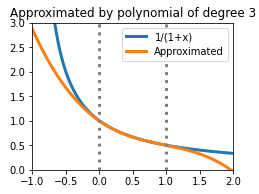
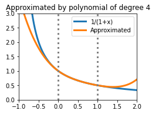

-   [Back to top page](../../)
-   [Back to other notes](../)

# Sollyaによる最良近似多項式の算出

(2022.6.2 大幅更新)

## 概要

Sollya（[https://www.sollya.org/](https://www.sollya.org/)）とは、浮動小数点演算ライブラリの作成を補助するツールであり、その機能の一つとして「与えられた式に対する最良多項式近似を求める」というものがある。

最良多項式近似とは、関数 f(x) を多項式 g(x) で近似するにあたり、差の最大値 $$\max_x\lvert f(x) - g(x) \rvert$$ が最小になるような多項式を用いるというものである。もっとも、「任意の x について」ということを考えては、多くの場合は差の最大値が無限大に発散するため、x の範囲をあらかじめ決めたうえで差の最大値を最小化する。一般に多項式近似を行う際には、x の範囲を狭くしたほうが精度を上げるのが容易になるとされる。

以下に例として、$$\frac{1}{1+x}$$ を $$x\in[0, 1]$$ に対する3次ならびに4次の最良近似多項式で表したものを示す（青が $$\frac{1}{1+x}$$、橙がそれの近似）。$$x\in[0, 1]$$ ではよく近似できているものの、それ以外では離れていくということがわかる。

## Sollyaの導入

Sollya 8.0の場合、DebianもしくはUbuntuについてはインストール管理ソフトのAPTでインストールできる。Windows環境でも、Windows Subsystem for Linux上のUbuntuで問題なくインストールできました。

    # apt install sollya

またソースコードからもインストールできる。この場合、以下のライブラリを事前にインストールしておく必要がある（READMEから抜粋）。

>   gcc, g++, gnuplot, gmp, mpfr, mpfi, libxml2-dev, [fplll](https://github.com/dstehle/fplll), libtool

## 動かす

「sollya」コマンドでsollyaを起動すると、プロンプトが表示されるので、

    remez(1/(1+x), 3, [0;1]);

と入力すると

    0.99873734200703370255650542617590628500070645822908 + x * (-0.95079348766754853145575955686649968095374245776006 + x * (0.6862914918332974716537832986049998194156383639214 + x * (-0.23549800416574894019802374173850013846189590616134)))

と表示される。これが $$\frac{1}{1+x}$$ の $$x\in[0, 1]$$ に対する3次の最良近似多項式である。また、

    g=remez(1/(1+x), 3, [0;1]);
    dirtyinfnorm(g-1/(1+x),[0;1]);

と入力すると、

    1.26265896698753297463116454110043606729501037121705e-3

と表示される。これは3次の最良近似多項式 g ともとの式 $$\frac{1}{1+x}$$ とのinfnorm（[無限ノルム](https://ja.wikipedia.org/wiki/Lp%E7%A9%BA%E9%96%93)。この場合は「差の絶対値の最大値」を意味する）、すなわち近似による誤差の最大値である。誤差が高々0.00126程度であることがこれでわかった。

なお、これらのコマンドは直接入力するのではなく、ファイルに書いて「sollya ファイル名」として呼び出してもよい。

利用可能な関数一覧は[Sollya User's Manual](https://www.sollya.org/sollya-8.0/help.php?name=listOfCommands)（英語）を参照されたい。

## 例

「$$\frac{1}{1+x}$$ の $$x\in[0, 1]$$ に対するn次の最良近似多項式（$$3\leq n\leq 10$$）の近似誤差の最大値を求める」sollyaプログラムを示す。（[ダウンロード](compute_approximator.sollya)）

    for n from 3 to 10 do {
      print("Degree of polynomial:", n);
    
      // n次の最良近似多項式を求める
      g = remez(1/(1+x), n, [0;1]);
      print("Approximator:", g);
      
      // 近似誤差の最大値を求める
      d = dirtyinfnorm(g-1/(1+x),[0;1]);
      print("Maximum error:", d);
      print("");
    };

最大誤差を見ると以下の通りで、近似に用いる多項式の次数が高いほど誤差も小さくなっていることが確認できる。

|多項式の次数|最大誤差|
|:---:|:---:|
|3|$$1.26266\times 10^{-3}$$|
|4|$$2.16638\times 10^{-4}$$|
|5|$$3.71692\times 10^{-5}$$|
|6|$$6.37723\times 10^{-6}$$|
|7|$$1.09416\times 10^{-6}$$|
|8|$$1.87728\times 10^{-7}$$|
|9|$$3.22091\times 10^{-8}$$|
|10|$$5.52621\times 10^{-9}$$|
